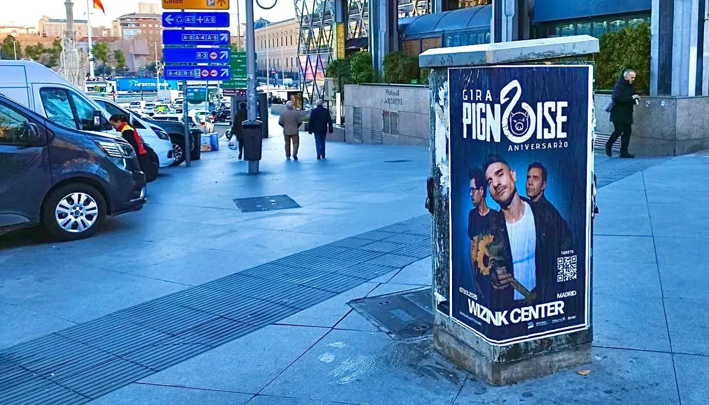

Pignoise foi fundado em Madrid no início deste século e reuniu Álvaro Benito (jogador do Real Madrid, Getafe e da seleção espanhola) e o também futebolista Héctor Polo. A eles juntou-se Pablo Alonso e imediatamente começaram a gravar discos e a dar concertos.

Depois de «Melodías desafinadas» (2003) e «Esto no es un disco de punk» (2005), gravaram o tema «Nada que perder» como tema musical da série de televisão espanhola «Los hombres de paco». Foi um grande sucesso.

Atualmente celebram o seu 20.º aniversário no WiZink Center de Madrid no próximo dia 7 de março de 2025. E, como tem sido habitual, já começámos a colar os cartazes de promoção do concerto um ano antes do evento.

