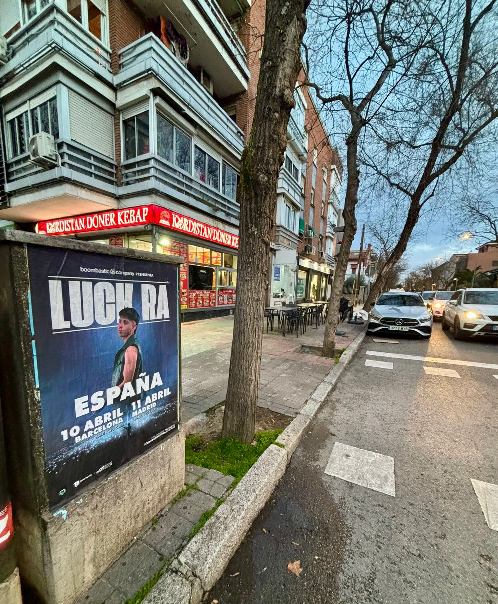

Há anúncios que se veem no ecrã e anúncios que te aparecem no caminho do trabalho. Os segundos são os que pusemos em marcha para a chegada de Luck Ra a Espanha, o artista argentino que traz seu quarteto cordobês misturado com ritmos urbanos a duas cidades em duas noites seguidas. Se te cruzaste com a cara dele numa parede do teu bairro, já sabes do que se trata.

## Como anunciamos Luck Ra na rua

Quando uma digressão tem duas datas tão próximas, o trabalho de rua tem de estar pronto antes. Neste caso, colocamos cartazes com toda a informação do evento: o nome do artista, a palavra ESPANHA, as duas datas, as duas cidades, as salas e o site onde se compram os bilhetes.

O cartaz que se vê na foto está sobre um suporte da via pública, numa esquina e junto a uma rua onde passa gente a pé e também carros. Esse é o sítio onde uma **colagem de cartazes** rende de verdade: num ponto com que te cruzas sem o procurar, ao virar da esquina de casa ou a caminho do trabalho.

Para o concerto de Barcelona, o cartaz aponta para o Sant Jordi Club no dia 10 de abril. Para o de Madrid, ao Palacio Vistalegre no dia 11 de abril. Em cima aparece a assinatura da promotora e em baixo o site de bilhetes. Nada mais. Uma mensagem simples, porque na rua ninguém para para ler um parágrafo.

## Duas cidades, duas datas e a mesma mensagem

Este tipo de campanhas monta-se por zonas de passagem, perto de locais de concertos e em ruas com movimento. A ideia não é encher a cidade de cartazes, mas sim que os que puseres estejam onde as pessoas olham. Aqui trabalhamos duas cidades ao mesmo tempo, com um mesmo design e uma mesma chamada à ação:

- Barcelona: 10 de abril no Sant Jordi Club.
- Madrid: 11 de abril no Palacio Vistalegre.
- Bilhetes à venda em boombasticcompany.com.

## O que o marketing de rua traz para um evento

O **marketing de rua** não compete com as redes sociais, acompanha-as. Um cartaz na rua faz algo que um post não faz: está lá quando a pessoa não está a olhar para o telemóvel. Para uma digressão curta, com duas datas muito seguidas, isso conta e muito.

A colagem de cartazes é uma das ferramentas mais diretas que existem para que um concerto soe na cidade dias antes. Não é preciso um grande orçamento, é preciso acertar no sítio. E isso é o que sabemos fazer.

Se tens um concerto, uma digressão ou um evento e queres que a cidade saiba, colocamo-lo na rua por ti.
