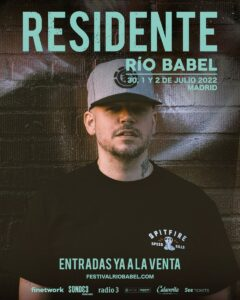

O Festival Rio Babel 2022, que se celebrará de 30 de junho a 2 de julho em La Caja Mágica de Madrid, conta já com três cabeças de cartaz das mais variadas e com um inquestionável poder de atração popular.

* Quinta-feira 30 de junho: Dani Martín
* Sexta-feira 1 de julho: C. Tangana
* Sábado 2 de julho: Residente

Os passes podem ser comprados já no site oficial do festival a partir de 80 euros. Além disso, se quiseres ver Dani Martín no Rio Babel 2022, tens um lote de bilhetes em oferta por 35 euros para esse dia. Custa o mesmo no dia de Residente, enquanto que o C. Tangana sobe até 40 euros.

Após o sucesso alcançado no seu formato adaptado, reunindo 40.000 espetadores no Estádio Wanda Metropolitano durante uma série de concertos no passado mês de julho, o Festival Río Babel voltará em 2022 com o seu formato original.

Um regresso aguardado, no qual o festival madrileno muda de localização para La Caja Mágica. Crescendo assim em dimensões e capacidade para esta nova edição, que se espera, agora sim, seja a do reencontro com a velha normalidade.

> O Festival Río Babel 2022, será nos dias 30 de junho, 1 e 2 de julho de 2022. “Contará com artistas internacionais de primeiro nível que lhes permitirá voltar a pôr Madrid a dançar”, adianta a organização.
