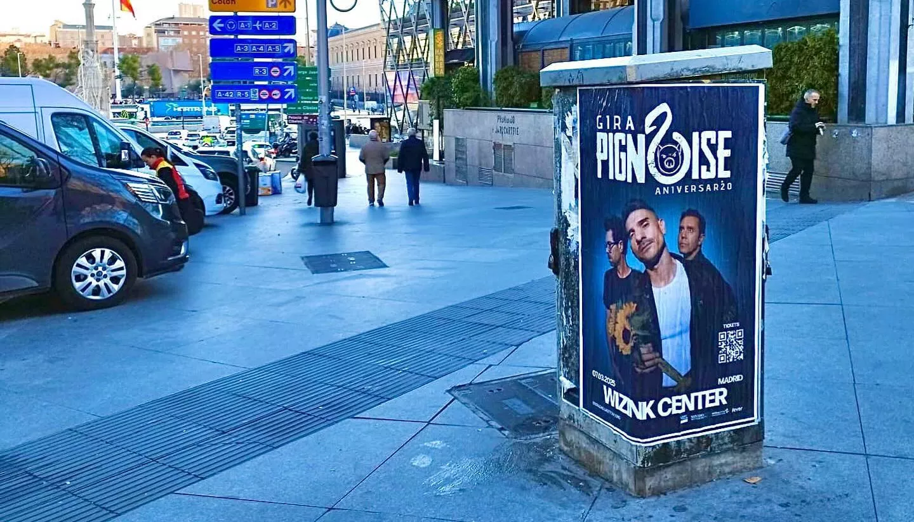
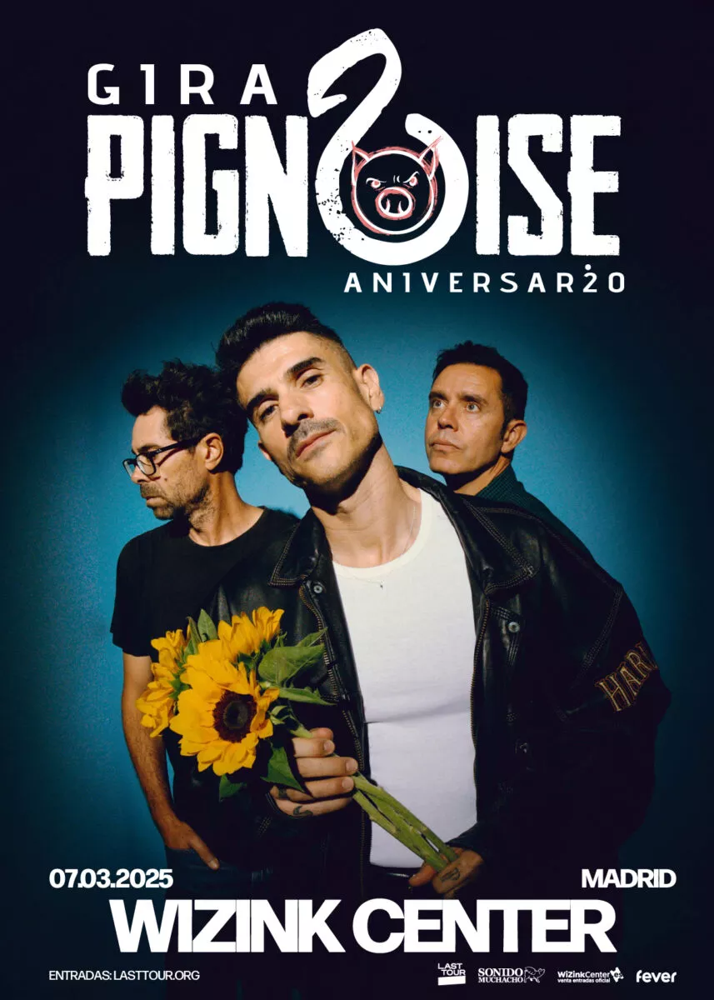

Pignoise se fundó en Madrid a principios de este siglo y reunió a Álvaro Benito (jugador del Real Madrid, Getafe y la selección española) y el también futbolista Héctor Polo. A ellos se  unió Pablo Alonso e inmediatamente empezaron a grabar discos y a dar conciertos.

Después de "Melodías desafinadas'' (2003) y "Esto no es un disco de punk" (2005), grabaron el tema "Nada que perder" como tema musical de la serie española de televisión "Los hombres de paco''. Fue un gran éxito.

Actualmente celebran su 20 aniversario en el WiZink Center de Madrid el próximo 7 de Marzo de 2025. Y, como viene siendo habitual, ya hemos empezado a pegar los carteles de promoción del concierto un año antes del evento.

