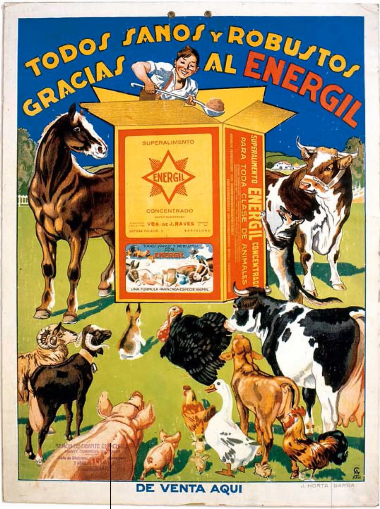

## De los inicios artesanales a la profesionalización

La costumbre de pegar carteles en Madrid se remonta a principios del siglo XX, cuando la ciudad empezaba su transformación en una gran urbe. En aquella época, Madrid contaba con poco más de 500.000 habitantes y estaba inmersa en un proceso de crecimiento e industrialización. Sin embargo, las posibilidades de comunicación masiva eran aún limitadas, ya que ni la radio ni la televisión se habían popularizado todavía.

Fue entonces cuando la [pegada de carteles en Madrid](/) de forma manual se consolidó como una de las formas más efectivas para promocionar los diversos eventos culturales, desde obras de teatro y conciertos hasta peleas de gallos y corridas de toros. Los primeros carteles solían ser anuncios manuscritos o impresos de manera artesanal en papel. Voluntarios se encargaban de pegarlos a mano en las farolas, esquinas y muros de la ciudad para dar a conocer las actividades entre los vecinos de madrileños.

Con el paso de los años, la tradición fue profesionalizándose. A medida que la urbe crecía en tamaño e importancia, surgieron las primeras imprentas que se dedicaban a la elaboración de carteles de manera semindustrial. Los diseños ganaron en calidad y complejidad gracias a las nuevas técnicas de impresión. Sin embargo, se mantuvo el espíritu artesano de los orígenes, con grupos de personas repartiendo los carteles a mano por toda la geografía madrileña.

## La consolidación de una seña de identidad

A lo largo del siglo XX, la pegada de carteles se fue consolidando como una auténtica seña de identidad de la capital de España. Conforme Madrid se convertía en una gran metrópolis, la costumbre de anunciar eventos culturales a través de estos anuncios callejeros se extendió por todos los barrios.

Las farolas, esquinas y muros de la ciudad se llenaban de carteles de los más variados diseños y colores, anunciando desde obras de teatro hasta conciertos de música moderna. Cada cartel era un pequeño trozo de historia que pervivía durante semanas en el mobiliario urbano, dejando constancia de la intensa vida cultural de la ciudad.

La evolución de los soportes y diseños fue paralela al desarrollo tecnológico de las siguientes décadas. De la serigrafía se pasó a la impresión offset y, más tarde, a las primeras impresiones digitales a color. Los carteles dejaban de ser simples anuncios manuscritos para convertirse en auténticas obras de arte urbano. Sin embargo, la esencia se mantuvo: promocionar la cultura madrileña a través de anuncios callejeros.

## Normativas para regular la colocación de carteles

Pese a ser una tradición muy arraigada entre promotores culturales y colectivos, no todo el mundo veía la pegada de carteles con buenos ojos. Algunos vecinos y asociaciones la consideraban un elemento que ensuciaba la estética de las calles y fachadas de la ciudad.

También había quejas por el exceso de carteles apilados en algunas zonas, lo que daba lugar a un aspecto desordenado. Por este motivo, a finales del siglo XX el Ayuntamiento de Madrid empezó a establecer una serie de normativas para regular su pegada. Se fijaron límites en cuanto a tamaños, soportes permitidos y plazos de retirada.

Del mismo modo, se establecieron sanciones para aquellos que incumplieran las ordenanzas municipales. El objetivo era preservar la tradición sin que afectara negativamente a la imagen de la capital. Aun así, la costumbre se mantuvo muy arraigada entre los colectivos culturales.

## Más que una función promocional

Pese a su función promocional, con el paso del tiempo los carteles callejeros de Madrid acabaron convirtiéndose en algo más que simples anuncios. Se transformaron en auténticas muestras del pulso cultural de la ciudad, reflejando a través de sus diseños y mensajes las tendencias artísticas de cada época.

Cada cartel pasaba a formar parte, aunque de manera efímera, del paisaje urbano madrileño. Suponían una forma de conocer de un vistazo qué espectáculos se representaban en cada momento, desde los clásicos del Siglo de Oro hasta las vanguardias artísticas. Incluso cuando desaparecían, habían dejado su huella como testigos de la historia reciente de la capital.

## La pegada de carteles madrileña hoy día

A pesar de la aparición de nuevos canales de comunicación digitales, la tradición de los carteles callejeros pervive en Madrid. Más de un siglo después de sus inicios, sigue cumpliendo su función de promocionar la intensa vida cultural de la ciudad. Es por ello que promotores culturales y asociaciones continúan apostando por esta herramienta, que aúna eficacia y bajo coste.

Si bien la normativa municipal ha profesionalizado su pegada, también se ha flexibilizado para permitir su uso a colectivos sin ánimo de lucro. Pese a las críticas de algunos, los carteles callejeros forman parte del acervo cultural e identitario de Madrid. Una tradición que, más de un siglo después de sus inicios, pervive gracias a su capacidad para promocionar la cultura en la calle.