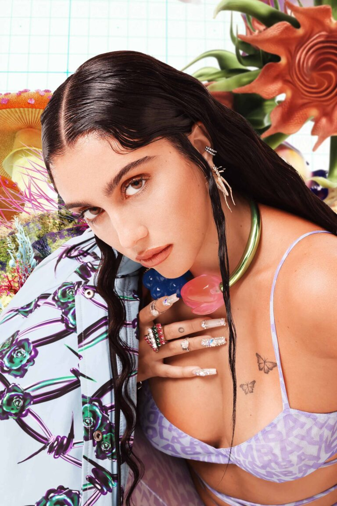

El otoño-invierno 2021 de Bimba y Lola se tiñe de creatividad futurista en la campaña #thisisTECHNONATURE. Una propuesta para la que la firma de moda y accesorios gallega ha fusionado el talento de nombres como Isamaya Ffrench, Lourdes Leon y Carlos Sáez.

Rodeada de intensos colores y de luces brillantes, la artista multidisciplinar Lourdes Leon se adentra en una desconocida dimensión onírica, en la que aparecen la flora y la fauna presentes en la última colección de Bimba y Lola. Piezas de diseño original entre las que destacan los bolsos LB de piel acolchada o recubiertos de «fake fur» de colores, así como una camiseta que brilla en la oscuridad o una completa selección de bisutería, en la que no faltan anillos, pulseras de cadena o chokers.

Con la hija de Madonna como musa de las imágenes capturadas por Hugo Yangüela, Bimba y Lola ha contado con nuestros servicios para realizar una acción de pegada de carteles en Madrid.

