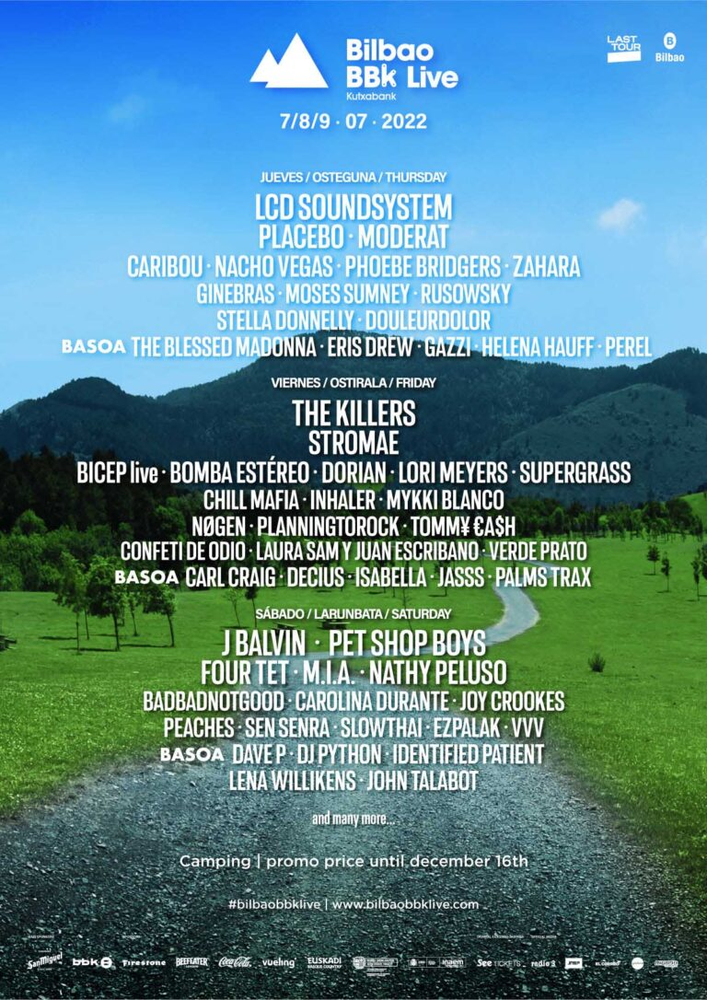

[BBK Live 2022](https://www.bilbaobbklive.com/es) serán tres días de festival en Kobetamendi en los que se darán cita bandas de todos los géneros y cuyos cabezas de cartel serán LCD Soundsystem, The Killers, Placebo,  Stromae, Pet Shop Boys o J Balvin entre muchos mas. Un cartel convincente y muy bailable.

> Las fechas serán el 7,8 y 9 de julio de 2022 y puedes comprar tus entradas aquí.

