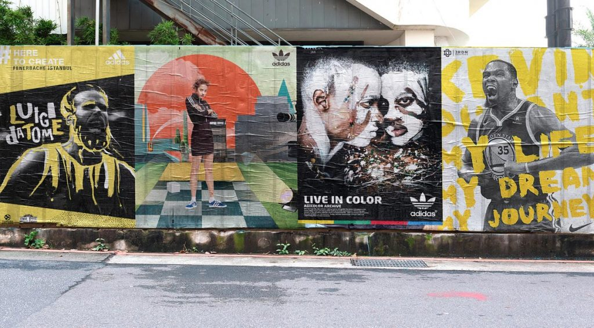

Cuando uno piensa en wild posting, probablemente piense en vallas perimetrales de zonas en construcción empapeladas con anuncios de conciertos o servicios. Puede que no pienses en la marca. Pero deberías. El wild posting proporciona una excelente plataforma para promocionar o crear una marca. Permite a las empresas presentar lo que la diferencia de la competencia y las hace únicas.

Cuando te enfocas en la marca en una campaña de wild posting harás mucho más que promocionar sólo un evento o producto. Promocionas tu identidad, lo que va mucho más allá del día exacto en que la gente ve la campaña.

## ¿Cómo utilizar correctamente una campaña de wild posting para promocionar tu marca?

Sigue estos 7 consejos para hacer que su campaña de wild posting sea recordada y encuentre el lugar correcto al que dirigirse, llevando su mensaje a las personas adecuadas y generando un impacto de marketing duradero.

## ¿Por qué es importante la marca?

Primero, una breve introducción a la importancia de crear una marca reconocible.

La razón de crear una marca es bastante simple: diferenciarte de la competencia. En la mayoría de la industria, hay muchas empresas que hacen lo mismo que tú. La marca es el argumento de por qué la gente debería elegirte a ti y no las otras opciones. La marca hace una promesa, y esa promesa atrae la atención de la gente. La marca encapsula el carácter de su negocio y lo empaqueta de una manera fácil de consumir.

No basta con vender un producto. Tienes que hacerlo lo mejor posible, ser el más creativo en tu industria u ofrecer el mejor servicio al cliente. Algo debe diferenciarte, de lo contrario la gente no te elegirá.

Las marcas pueden elegir muchas imágenes diferentes para seguir, como:

* Confiable y estable
* Nuevo e innovador
* Eco-consciente o solidario
 
Independientemente de lo que elijas, debes ofrecer esa imagen de forma coherente. Aquí es donde entran las campañas de wild posting y pegada de carteles. Puedes transmitir el mismo mensaje en una variedad infinita de lugares con una campaña de wild posting.

Estos consejos le ayudarán a mantener su mensaje y a lograr los resultados que desea.

[center][/center]

## 1. Determina cómo encaja la campaña de wild posting en tu estrategia.
 
> La estrategia de una campaña de marketing son las cuatro preguntas de la publicidad: qué, dónde, cuándo y quiénes reciben sus mensajes.

Si bien ya sabemos el cómo, ya que has elegido realizar una campaña de wild posting, debes determinar las otras tres preguntas mediante el uso de datos y experiencia.

Por ejemplo, debes orientar tu campaña de wild posting en un área donde llegará a los consumidores que probablemente comprarán su producto. Si estás promocionando un álbum de Lady Gaga o Viva Suecia, por ejemplo, probablemente quieras anunciarlo en algún lugar o entorno urbano donde sea probable que estén sus fans, como en el camino a festivales como el Mad Cool o BBK Live.

## 2. Define tus metas antes de comenzar.

Realizar una campaña de pegada de carteles o de wild posting sin una estrategia previa es simplemente malgastar tu dinero. Debes establecer objetivos claros para tu campaña. Cuando hacemos una campaña de wild posting es posible que también desees ganar seguidores o likes en las redes sociales, incluso impulsar las ventas de álbumes.

El wild posting puede ser parte de campañas de mayor calado que también pueden incluir otros elementos de marketing como publicidad en vehículos de uso público como autobuses o incluso campañas en vallas publicitarias.

## 3. Utiliza elementos creativos que fomenten los esfuerzos de desarrollo de la marca

La creatividad que utilicemos en el wild posting es fundamental. La gente absorbe las imágenes repetidas y las asocia con tu empresa y entonces pensarán en ella cada vez que vean una creatividad similar.

La creación de asociaciones lo mantiene en la mente de los clientes potenciales y es por eso que el wild posting es un sistema tan efectivo. La repetición genera reconocimiento. Por lo tanto, necesita una creatividad increíble que atraiga la atención de la gente. Vale la pena invertir en asistencia profesional para esto porque los profesionales comprenden la diferencia entre un dibujo o logotipo atractivo y uno motivador.

No quieres que la gente piense: «Eso es lindo». Quieres que piensen: «Necesito eso».

## 4. Agrega palabras (a veces) pero elíjelas con sumo cuidado

Un buen texto puede reforzar el mensaje de tu marca en una campaña de wild posting, pero no deberían ser el foco de la misma. El wild posting es un medio de transmisión más visual que casi cualquier otra forma de publicidad exterior.

Al tratarse de una repetición de imágenes varias veces puede usar diferentes colores de papel u otras técnicas para hacer se destaque, pero un texto no adecuado puede ocasionar que se desvirtúe el mensaje que queremos transmitir a nuestros clientes.

Limita las palabras que usas y asegúrate de que sean realmente impactantes. Deben transmitir información vital o un eslogan limitado que posteriormente se pueda vincular a tu marca. Por ejemplo, el «Just Do It» de Nike es un ejemplo de marca icónica que combina de manera efectiva lo visual (curva) con las palabras del propio mensaje.

Seis palabras o incluso menos es bueno. Pero no agregues palabras solo para tenerlas. Se puede conseguir una campaña de wild posting exitosa sin escribir absolutamente nada.

## 5. Enfatiza la coherencia en tus mensajes.

La marca tiene que ver con la coherencia. Eso no significa usar exactamente la misma creatividad cada vez, pero sí significa transmitir el mismo mensaje.

Considera lo que quieres decir sobre tu empresa y cómo quieres decirlo. Una campaña de wild posting es tan simple que es fácil subestimarla y convertirla en insignificante. No hagas eso.

## 6. Tómate tu tiempo.
Estamos seguros de que quieres algo con lo que estés feliz y te satisfaga. Hazte a la idea de que el mismo mensaje estará pegado por todas partes de la ciudad, y si decides llegar a algo sin trabajarlo lo suficiente o intenta hacerlo en casa sin invertir el esfuerzo suficiente en una imagen de aspecto profesional terminarás frustrado cuando veas tu campaña por todas partes.

## 7. Considera los “datos” y la experiencia en todas las tomas de decisiones.

En Urban Style Publicity creemos que todo es mejor analizando los datos que nos suministra una campaña de wild posting y la experiencia que llevamos a nuestras espaldas trabajando con las mejores empresas nacionales e internacionales.

Mientras planificamos tu estrategia de distribución y dónde colocar la campaña de wild posting, tú observa la ciudad y todas las pequeñas cosas que juegan en cada campaña de marketing o publicidad.

Siempre debes tener una idea firme de por qué estás haciendo algo y poder respaldarlo con números. Esto se aplica tanto a la creación de una marca, como a la venta o a la promoción de un evento o servicio.

> A veces, cuando decimos «datos», los ojos de las personas se abren como platos, pero sinceramente en urban style publicity creemos que toda la publicidad eficaz se basa en los datos. Cualquiera que te diga lo contrario no comprende el negocio. Por eso llevamos más de 15 años siendo la empresa líder en pegada de carteles y wild posting, porque lo podemos acreditar con “datos”.

