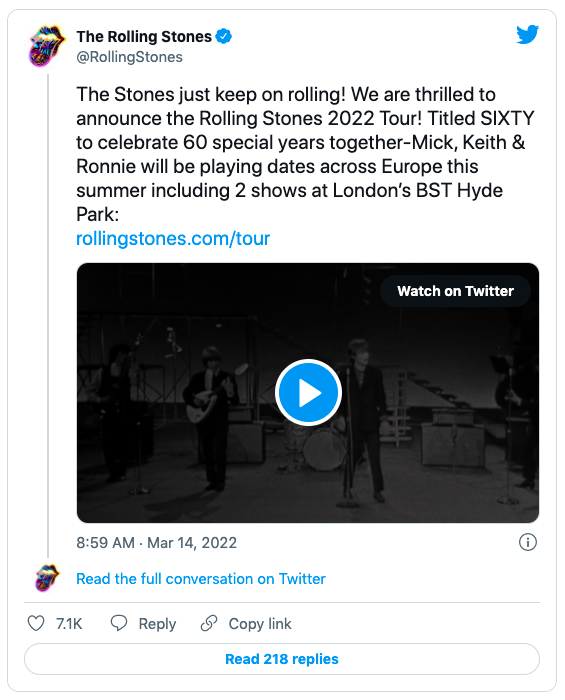
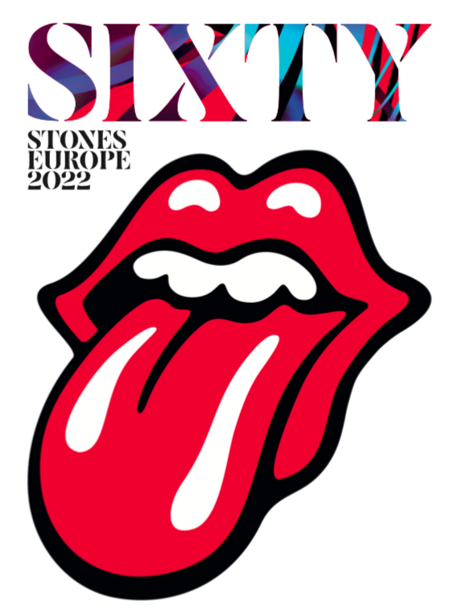

Madrid es la ciudad elegida por The Rolling Stones para comenzar su próxima gira europea, “SIXTY” (sesenta), con la que celebran sesenta años juntos. Será el próximo 1 de junio en el Wanda Metropolitano, según han anunciado en Twitter.

[center][/center]

La banda recorrerá con esta gira diez países y ofrecerá dos conciertos en Londres. La última vez que Mick Jagger y compañía actuaron en Madrid fue en 2014, en el estadio Santiago Bernabéu como parte de “14 on Fire Tour”.

Según ha anunciado la promotora Live Nation, las entradas se pondrán a la venta este viernes 18 de marzo a las 10:00. Se podrán adquirir en las web de doctormusic.com, entradas.com, livenation.es, ticketmaster.es y lasttour.org.

A esta gira, el grupo llega con una ausencia notoria, la del batería Charlie Watts, que falleció el pasado mes de agosto a los 80 años tras más de medio siglo de carrera en sus filas.

[center][/center]

Para este aniversario, The Stones, que el año pasado hicieron una gira por Estados Unidos (No Filter), han preparado una nueva producción y un nuevo diseño de su conocida lengua. Podréis ver ese nuevo diseño en la pegada de carteles tanto en Madrid como Barcelona anunciando la gira de sus Satánicas Majestades.