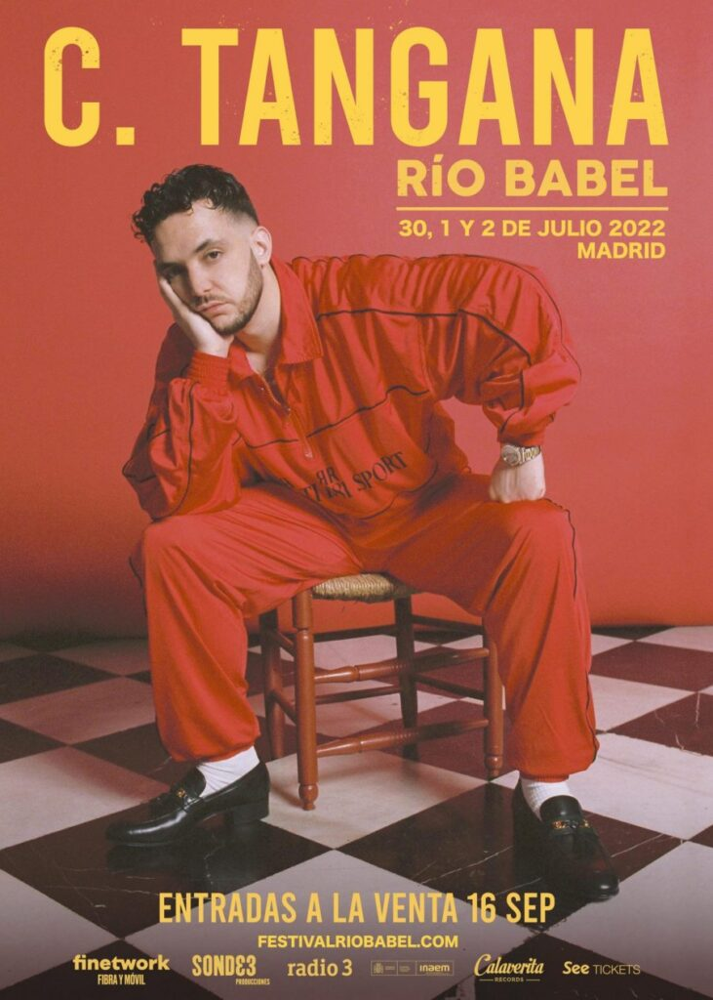
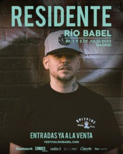

El Festival Rio Babel 2022, que se celebrará del 30 de junio al 2 de julio en La Caja Mágica de Madrid, cuenta ya con tres cabezas de cartel de lo más variadito y con un incuestionable tirón popular.

* Jueves 30 de junio: Dani Martín
* Viernes 1 de julio: C. Tangana
* Sábado 2 de julio: Residente

Los abonos se pueden comprar ya en la web oficial del festival desde 80 euros. Además, si quieres ver a Dani Martín en Río Babel 2022 tienes un cupo de entradas en oferta por 35 euros para esa jornada. Cuesta lo mismo el día de Residente, mientras que el C. Tangana sube hasta 40 euros.

Tras el éxito cosechado en su formato adaptado, reuniendo a 40.000 asistentes en el Estadio Wanda Metropolitano durante una serie de conciertos el pasado mes de julio, el Festival Río Babel volverá en 2022 con su formato original.

Un esperado regreso, en el que el festival madrileño cambia de ubicación a la Caja Mágica. Creciendo así en dimensiones y aforo para esta nueva edición, que se espera, ya sí, sea la del reencuentro con la vieja normalidad.

> El Festival Río Babel 2022, será los días 30 de junio, 1 y 2 de julio de 2022. “Contará con artistas internacionales de primer nivel que les permitirá poner de nuevo a Madrid a bailar”, avanza la organización.